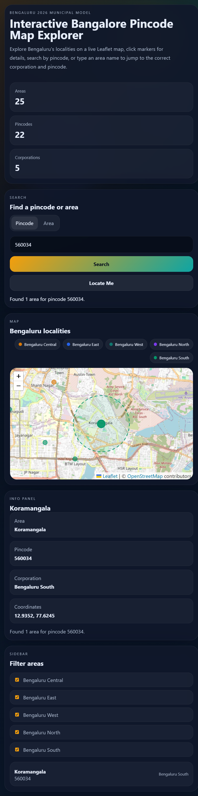

# Bangalore Pincode Map Explorer

A full-stack React + FastAPI app for exploring Bengaluru pincodes and localities on a live interactive map.

## Features

- Click any map marker to see the area, pincode, and corporation.
- Search by pincode to zoom into and highlight the matching area.
- Search by area name to get the pincode and pan to the location.
- Handles Bengaluru's 2026 five-corporation model using the provided dataset.
- Includes corporation filters, sidebar filtering, and browser geolocation as extra polish.

## Project Structure

- `frontend/` - React + Vite app with Leaflet map UI
- `backend/` - FastAPI REST API
- The Bengaluru dataset is embedded directly in `backend/main.py`

## Run Locally

### Backend

```bash
cd backend
python -m venv .venv
source .venv/Scripts/activate
pip install -r requirements.txt
uvicorn main:app --reload --host 127.0.0.1 --port 8000
```

### Frontend

```bash
cd frontend
npm install
npm run dev
```

Open the Vite URL printed in the terminal, usually `http://127.0.0.1:5173`.

For Vercel or any remote deployment, set `VITE_API_BASE_URL` in the frontend project to the deployed backend URL, for example `https://your-backend.vercel.app`.

## API

- `GET /api/areas` - returns the full dataset and summary counts
- `GET /api/lookup?pincode=560001` - returns matching area(s) for a pincode
- `GET /api/lookup?area=Koramangala` - returns matching pincode(s) for an area name
- `GET /api/nearest?lat=12.97&lng=77.59` - returns the nearest record for map clicks or geolocation

## Screenshot



## Notes

- The app uses approximate map circles because the dataset contains point coordinates, not polygon boundaries.
- The backend returns arrays for matches so duplicate pincodes in the dataset are handled safely.
- Area lookup supports partial matching, so `Korama` resolves to `Koramangala`.
- The UI keeps the map dominant and uses the sidebar for filtering and quick navigation.
- No standalone `pincodes.json` file is needed anymore; the backend ships with the dataset hardcoded in code.
- If the deployed frontend shows `Unable to load the dataset`, the backend URL is not configured in `VITE_API_BASE_URL`.

## Live Demo

- https://bangalore-pincode-map-explorer-lvkf-r42yo8p55.vercel.app/
